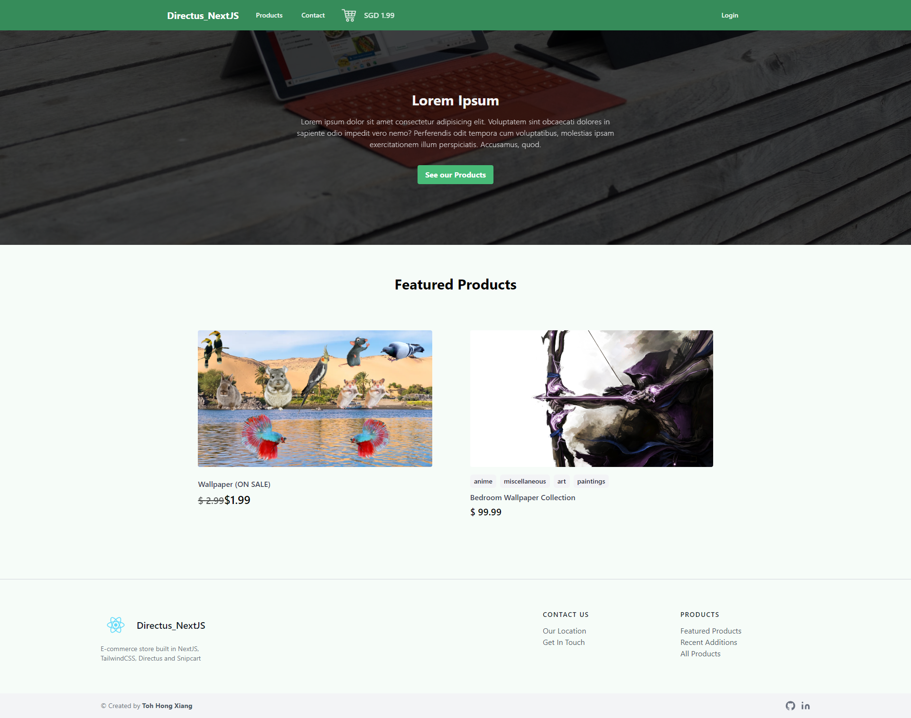
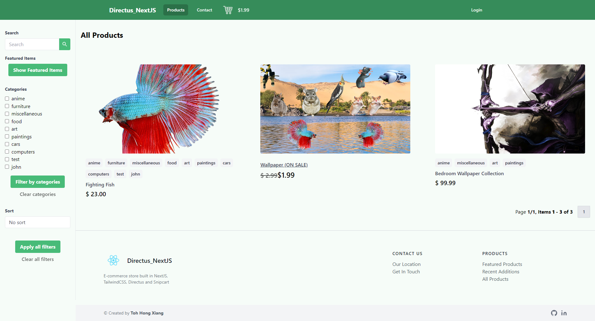
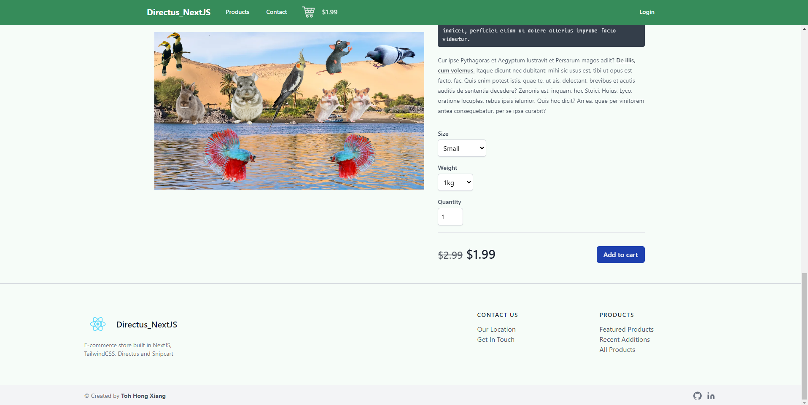
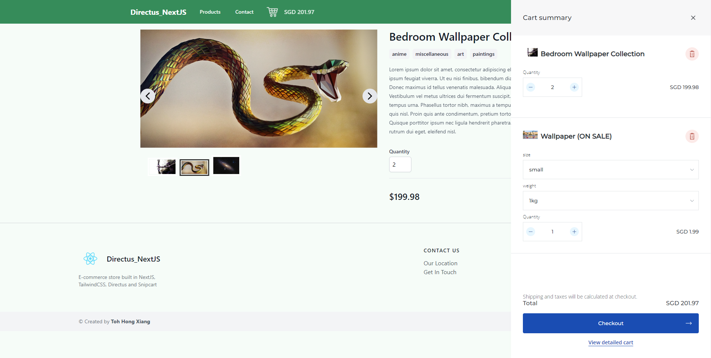
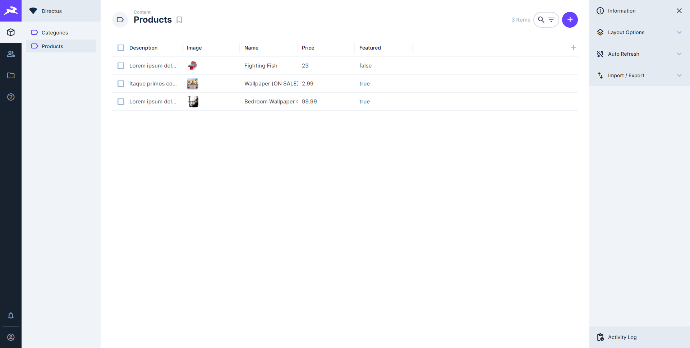
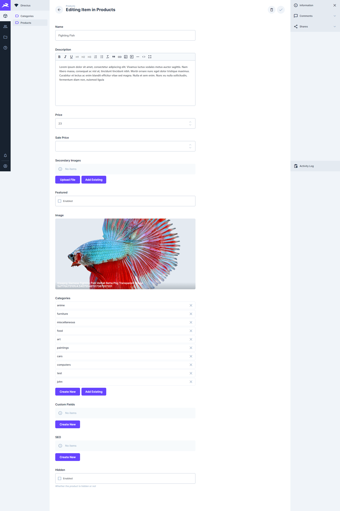

# Directus NextJS Snipcart Integration

This is a fully-fledged E-commerce template built using NextJS, Directus and Snipcart. Features include:
- Landing page
- Featured Products section
- Products listing page (with pagination and filtering)
- Contact Us page
- Directus Content Management System for shop owners to add/update/delete their products

## Previews of Webpage


Main Landing Page:


Product listing page:


Product page:


Open cart:


Directus product listing:


Directus edit product:


# Local Setup

1. Clone and install dependencies

```
git clone https://github.com/tohhongxiang123/directus-nextjs.git
cd directus-nextjs
npm install
```

> Note: `npm install` might fail due to `node-gyp` (a dependency within directus). To fix this, run `npm install directus` then `npm install` again

2. Copy `.env.example` to `.env` and fill in the details
3. Within postgres, create a database `directus-nextjs`, then restore database using `database-backup.sql`

```
psql -U postgres -d directus-nextjs -f database-backup.sql
```

Afterwards, update directus databases

```
npx directus database migrate:latest
```

> Note: This database sample comes with a default admin account that comes with directus: `admin@example.com`, `123456789`

4. Start servers

```
npm run dev
```

Frontend is on `http://localhost:3000`, while directus server will be on `http://localhost:8055`

# Setup from a clean ubuntu

1. From local, create a database dump and copy into remote

```
pg_dump -U postgres next-auth-client > directus-dump 
scp directus-dump username@host:/home/username/directus-dump
```

2. Update all packages. Install postgres and relevant packages. Create a new database, and dump data into the database.

```
sudo apt update
sudo apt install postgresql postgresql-contrib
sudo -u postgres createdb shopping-seshuri
sudo -u postgres psql shopping-seshuri < directus-dump
```

3. Create a new postgres user. Check that the user exists with the command `\du`

```
sudo -su postgres psql
CREATE USER username WITH SUPERUSER PASSWORD 'password'
\du
\q
```

4. Create database and dump data within database

```
createdb shopping-seshuri
psql shopping-seshuri < directus-dump
```

To check whether the database is updated, you can run the following commands:

```
sudo -su postgres psql
\c shopping-seshuri
\d products
```

5. Clone the repository, and install required packages

```
git clone https://github.com/tohhongxiang123/directus-nextjs.git
cd directus-nextjs
npm ci
```

6. Create `.env` file and fill it in

```
cp .env.example .env
nano .env
```

`.env.example` contains a partially filled `.env` file. Change the variables to fit your own needs. The important variables to take note of are:

## Variables used by Directus
- `DB_DATABASE` - Name of database
- `DB_USER` - Username of database
- `DB_PASSWORD` - Password of `DB_USER`
- `KEY` - Unique identifier for the directus project
- `SECRET` - Secret string for the directus project

More information and other `.env` variables are found [here](https://docs.directus.io/reference/environment-variables/#security)

## Variables used by NextJS

- `NEXT_PUBLIC_STOREFRONT_NAME` - Name of the store itself
- `NEXT_PUBLIC_STOREFRONT_URL` - Website where the frontend is located (http://localhost:3000)
- `DIRECTUS_URL` - Website where the backend is located (http://localhost:8055)
- `DIRECTUS_EMAIL` - Email used for directus admin user
- `DIRECTUS_PASSWORD` - Password used for directus admin user
- `SNIPCART_KEY` - Snipcart public key
- `SNIPCART_SECRET` - Snipcart secret key
- `SMTP_EMAIL` - Email to send notifications for new orders
- `SMTP_PASSWORD` - Password to send notifications for new orders
- `SEND_NOTIFICATIONS_TO_EMAIL` - Email to send the notifications to

To setup nodemailer for email notifications, follow [this](https://medium.com/nerd-for-tech/coding-a-contact-form-with-next-js-and-nodemailer-d3a8dc6cd645) and unlock display captcha [here](https://accounts.google.com/DisplayUnlockCaptcha)

You will also need to point snipcart's [webhook](https://app.snipcart.com/dashboard/webhooks) configuration to your website

- Create GMAIL account
- Go to "Manage your Google Account"
- Go to security
- Go to "Less secure app access"
- Allow
- Go [here](https://accounts.google.com/DisplayUnlockCaptcha) and unlock

1. Run the following commands to get the cms running

```
pm2 start npm --name "<cms-name>" -- run server
```

Run the following commands to get the frontend running

```
npm run build
pm2 start npm --name "<frontend-name>" -- start
```

Replace `<cms-name>` and `<frontend-name>` with what you require.

# Updating the project

Run the following commands in order to update the project

```
git pull
npm run build
pm2 restart <frontend-name> --update-env
pm2 restart <cms-name> --update-env
```

Replace `<cms-name>` and `<frontend-name>` with what you require.

# Overview

We are going to create an e-commerce application with the following stack:

- Directus as a headless CMS
- NextJS with TypeScript
- TailwindCSS for styling
- Snipcart for shopping cart

Here is the following feature scope we would like to achieve

- Customer able to login and view their purchase history
- Shopping cart that also allows user to be sent to checkout
- Customer able to pay
- Website owner able to login and update product catalogs (Add product, delete product, update product)
- Whenever product catalog is updated, products are also added to snipcart's inventory
- Inventory management to track quantities (within snipcart)

# Resources

- [Directus Quickstart](https://docs.directus.io/getting-started/quickstart/)
- [Manually adding NextJS](https://nextjs.org/docs#manual-setup)
- [Adding Typescript to NextJS](https://nextjs.org/docs/basic-features/typescript)
- [Adding TailwindCSS to NextJS](https://tailwindcss.com/docs/guides/nextjs)
- [NextJS API Routes](https://nextjs.org/docs/api-routes/introduction) and for [typescript](https://nextjs.org/docs/basic-features/typescript#api-routes)
- [TailwindUI's navbar](https://tailwindui.com/components/application-ui/navigation/navbars)
- [useOnClickOutside](https://usehooks.com/useOnClickOutside/)
- [Snipcart Getting Started](https://docs.snipcart.com/v3/setup/installation)
- [Directus Assets](https://docs.directus.io/reference/api/assets/)
- [SEO](https://snipcart.com/blog/react-nextjs-single-page-application-seo)
- [Snipcart API](https://docs.snipcart.com/v3/api-reference/introduction)
- [NextJS E-commerce Tutorial](https://snipcart.com/blog/react-ecommerce-tutorial)